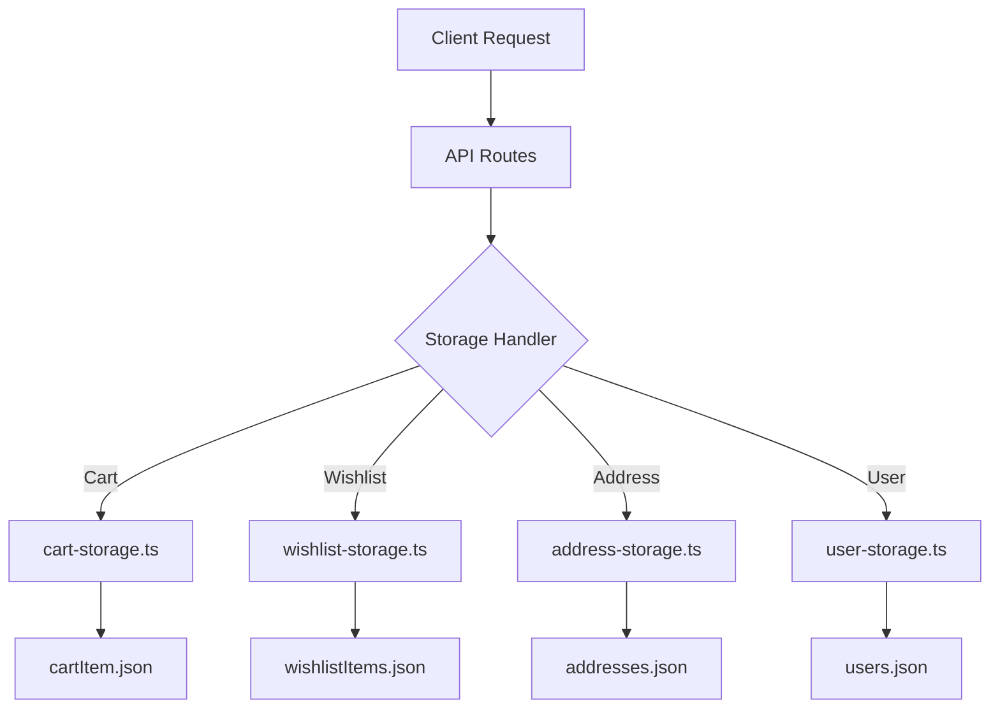
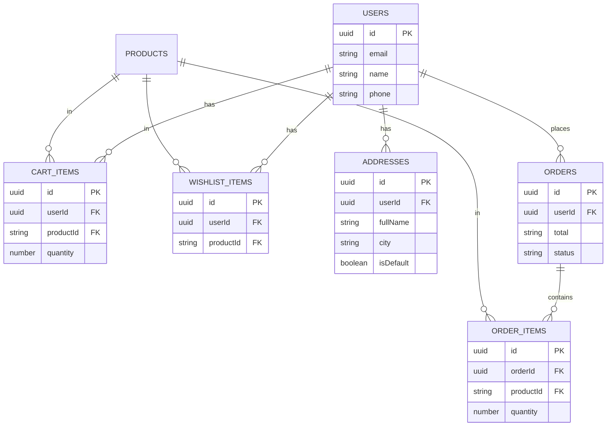

# Data Storage Documentation

## Overview

LIMINARA uses a **JSON-based file storage system** for all application data. Each data type is stored in dedicated JSON files for better organization, maintainability, and separation of concerns.

## Storage Architecture



## JSON Data Files

### 1. users.json
Stores user profile information.

**Location:** `data/users.json`

**Schema:**
```json
[
  {
    "id": "uuid",
    "email": "string",
    "name": "string",
    "phone": "string",
    "address": "string (legacy field)",
    "firstName": "string",
    "lastName": "string",
    "profileImageUrl": "string",
    "provider": "otp | auth0",
    "passwordHash": "string | null",
    "createdAt": "ISO-8601",
    "updatedAt": "ISO-8601"
  }
]
```

**Storage Handler:** [user-storage.ts](file:///f:/Liminara/Liminara28-11%20part%202/Liminara28-11%20part2/server/user-storage.ts)

**Functions:**
- `getUser(identifier)` - Get user by email/phone identifier
- `createOrUpdateUser(identifier, userData)` - Create or update user
- `updateUserProfile(identifier, profileData)` - Update user profile
- `deleteUser(identifier)` - Delete user
- `getAllUsers()` - Get all users

---

### 2. cartItems.json
Stores shopping cart items for all users.

**Location:** `data/cartItems.json`

**Schema:**
```json
[
  {
    "id": "uuid",
    "userId": "uuid (references users.id)",
    "productId": "string",
    "quantity": "number",
    "createdAt": "ISO-8601"
  }
]
```

**Storage Handler:** [cart-storage.ts](file:///f:/Liminara/Liminara28-11%20part%202/Liminara28-11%20part2/server/cart-storage.ts)

**Functions:**
- `getCartItems(userId)` - Get all cart items for a user
- `addToCart(userId, productId, quantity)` - Add item to cart
- `updateCartItem(userId, productId, quantity)` - Update item quantity
- `removeFromCart(userId, productId)` - Remove item from cart
- `clearCart(userId)` - Clear entire cart
- `getCartItemCount(userId)` - Get total quantity of all items

---

### 3. wishlistItems.json
Stores wishlist items for all users.

**Location:** `data/wishlistItems.json`

**Schema:**
```json
[
  {
    "id": "uuid",
    "userId": "uuid (references users.id)",
    "productId": "string",
    "createdAt": "ISO-8601"
  }
]
```

**Storage Handler:** [wishlist-storage.ts](file:///f:/Liminara/Liminara28-11%20part%202/Liminara28-11%20part2/server/wishlist-storage.ts)

**Functions:**
- `getWishlistItems(userId)` - Get all wishlist items for a user
- `addToWishlist(userId, productId)` - Add item to wishlist
- `removeFromWishlist(userId, productId)` - Remove item from wishlist
- `isInWishlist(userId, productId)` - Check if item is in wishlist
- `clearWishlist(userId)` - Clear entire wishlist

---

### 4. addresses.json
Stores user shipping/billing addresses.

**Location:** `data/addresses.json`

**Schema:**
```json
[
  {
    "id": "uuid",
    "userId": "uuid (references users.id)",
    "fullName": "string",
    "phone": "string",
    "addressLine1": "string",
    "addressLine2": "string (optional)",
    "city": "string",
    "state": "string",
    "pincode": "string",
    "isDefault": "boolean",
    "createdAt": "ISO-8601",
    "updatedAt": "ISO-8601"
  }
]
```

**Storage Handler:** [address-storage.ts](file:///f:/Liminara/Liminara28-11%20part%202/Liminara28-11%20part2/server/address-storage.ts)

**Functions:**
- `getUserAddresses(userId)` - Get all addresses for a user
- `getAddress(addressId)` - Get specific address by ID
- `createAddress(addressData)` - Create new address
- `updateAddress(addressId, data)` - Update existing address
- `deleteAddress(addressId, userId)` - Delete address
- `setDefaultAddress(userId, addressId)` - Set default address
- `getDefaultAddress(userId)` - Get user's default address

---

### 5. orders.json
Stores order information.

**Location:** `data/orders.json`

**Schema:**
```json
[
  {
    "id": "uuid",
    "userId": "uuid (references users.id)",
    "total": "string (price)",
    "paymentMethod": "cod | razorpay | stripe",
    "customerName": "string",
    "customerPhone": "string",
    "customerEmail": "string",
    "shippingAddress": "string",
    "pincode": "string",
    "status": "pending | processing | shipped | delivered | cancelled",
    "paymentId": "string | null",
    "paymentStatus": "pending | completed | failed",
    "razorpayOrderId": "string | null",
    "razorpayPaymentId": "string | null",
    "razorpaySignature": "string | null",
    "trackingId": "string | null",
    "createdAt": "ISO-8601",
    "updatedAt": "ISO-8601"
  }
]
```

---

### 6. orderItems.json
Stores individual items within orders.

**Location:** `data/orderItems.json`

**Schema:**
```json
[
  {
    "id": "uuid",
    "orderId": "uuid (references orders.id)",
    "productId": "string",
    "quantity": "number",
    "price": "string | number (price at time of order)",
    "createdAt": "ISO-8601"
  }
]
```

---

### 7. products.json
Stores product catalog information.

**Location:** `data/products.json`

**Schema:** _(Managed by main storage system)_

---

### 8. productReviews.json & productQuestions.json
Store product reviews and customer questions.

**Location:** `data/productReviews.json`, `data/productQuestions.json`

---

## API Endpoints

### Cart APIs

| Method | Endpoint | Description |
|--------|----------|-------------|
| GET | `/api/cart` | Get user's cart items with product details |
| POST | `/api/cart` | Add item to cart |
| PATCH | `/api/cart/:productId` | Update cart item quantity |
| DELETE | `/api/cart/:productId` | Remove item from cart |

**Request/Response Examples:**

```javascript
// POST /api/cart
{
  "productId": "cos-001",
  "quantity": 2
}

// Response
{
  "success": true,
  "message": "Added to cart"
}

// GET /api/cart - Response
[
  {
    "id": "uuid",
    "userId": "uuid",
    "productId": "cos-001",
    "quantity": 2,
    "createdAt": "2025-11-28T...",
    "product": { /* Product details */ }
  }
]
```

---

### Wishlist APIs

| Method | Endpoint | Description |
|--------|----------|-------------|
| GET | `/api/wishlist` | Get user's wishlist items with product details |
| POST | `/api/wishlist` | Add item to wishlist |
| DELETE | `/api/wishlist/:productId` | Remove item from wishlist |

**Request/Response Examples:**

```javascript
// POST /api/wishlist
{
  "productId": "cos-002"
}

// Response
{
  "success": true
}

// GET /api/wishlist - Response
[
  {
    "id": "uuid",
    "userId": "uuid",
    "productId": "cos-002",
    "createdAt": "2025-11-28T...",
    "product": { /* Product details */ }
  }
]
```

---

### Address APIs

| Method | Endpoint | Description |
|--------|----------|-------------|
| GET | `/api/user/addresses` | Get all addresses for user |
| POST | `/api/user/addresses` | Create new address |
| PUT | `/api/user/addresses/:id` | Update existing address |
| DELETE | `/api/user/addresses/:id` | Delete address |

**Request/Response Examples:**

```javascript
// POST /api/user/addresses
{
  "fullName": "John Doe",
  "phone": "9876543210",
  "addressLine1": "123 Main Street",
  "addressLine2": "Apt 4B",
  "city": "Mumbai",
  "state": "Maharashtra",
  "pincode": "400001",
  "isDefault": true
}

// Response
{
  "id": "uuid",
  "userId": "uuid",
  "fullName": "John Doe",
  "phone": "9876543210",
  "addressLine1": "123 Main Street",
  "addressLine2": "Apt 4B",
  "city": "Mumbai",
  "state": "Maharashtra",
  "pincode": "400001",
  "isDefault": true,
  "createdAt": "2025-11-28T...",
  "updatedAt": "2025-11-28T..."
}
```

---

## Data Relationships



---

## Migration Notes

### From Embedded to Dedicated Storage

The system has been migrated from storing cart/wishlist/orders within the user objects to dedicated JSON files:

**Before (Embedded):**
```json
{
  "user@email.com": {
    "name": "User",
    "cart": [...],
    "wishlist": [...],
    "orders": [...]
  }
}
```

**After (Dedicated):**
```json
// users.json
[{ "id": "uuid", "email": "user@email.com", "name": "User" }]

// cartItems.json
[{ "id": "uuid", "userId": "uuid", "productId": "..." }]

// wishlistItems.json
[{ "id": "uuid", "userId": "uuid", "productId": "..." }]
```

**Benefits:**
- ✅ Better separation of concerns
- ✅ Easier to query specific data types
- ✅ Reduced file size per JSON file
- ✅ More scalable structure
- ✅ Consistent UUID-based relationships

---

## Best Practices

1. **Always use database user IDs** (UUIDs) for relationships, not email/phone identifiers
2. **Validate data** before writing to JSON files using Zod schemas
3. **Handle errors gracefully** - return empty arrays for missing users
4. **Atomic operations** - read, modify, write in a single async operation
5. **Keep files small** - consider pagination for large datasets in the future

---

## Performance Considerations

- All JSON files are loaded into memory for each operation
- For large datasets, consider migrating to a proper database (MySQL/PostgreSQL)
- Current file-based approach is suitable for small to medium traffic
- Implement caching layer if performance becomes an issue

---

## Security

- User data is stored server-side only
- Session-based authentication required for all cart/wishlist/address operations
- UUIDs prevent enumeration attacks
- Input validation via Zod schemas

---

## Future Improvements

- [ ] Add data backup mechanism
- [ ] Implement database migration scripts
- [ ] Add data compression for large JSON files
- [ ] Create admin tools for data management
- [ ] Add analytics and reporting features
